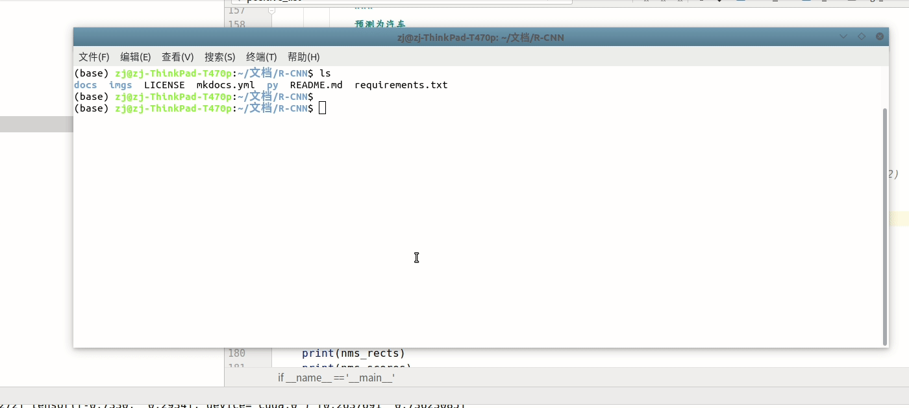

# R-CNN

[](https://r-cnn.readthedocs.io/zh_CN/latest/?badge=latest) [](https://github.com/RichardLitt/standard-readme) [](https://conventionalcommits.org) [](http://commitizen.github.io/cz-cli/)

> `R-CNN`算法实现

学习论文[Rich feature hierarchies for accurate object detection and semantic segmentation](https://arxiv.org/abs/1311.2524)，实现`R-CNN`算法，完成目标检测器的训练和使用

`R-CNN`实现由如下`3`部分组成：
 
 1. 区域建议算法（`SelectiveSearch`）
 2. 卷积网络模型（`AlexNet`）
 3. 线性分类器（线性`SVM`）

*区域建议算法使用`OpenCV`实现，进一步学习可参考[zjZSTU/selectivesearch](https://github.com/zjZSTU/selectivesearch)*

## 内容列表

- [背景](#背景)
- [安装](#安装)
- [用法](#用法)
- [主要维护人员](#主要维护人员)
- [参与贡献方式](#参与贡献方式)
- [许可证](#许可证)

## 背景

`R-CNN(Region-CNN)`是最早实现的深度学习检测算法，其结合了选择性搜索算法和卷积神经网络。复现`R-CNN`算法，也有利于后续算法的研究和学习

## 安装

### 本地编译文档

需要预先安装以下工具：

```
$ pip install mkdocs
```

## 用法

### 文档浏览

有两种使用方式

1. 在线浏览文档：[R-CNN](https://r-cnn.readthedocs.io/zh_CN/latest/)

2. 本地浏览文档，实现如下：

    ```
    $ git clone https://github.com/zjZSTU/R-CNN.git
    $ cd R-CNN
    $ mkdocs serve
    ```
    启动本地服务器后即可登录浏览器`localhost:8000`

## python实现

```
$ cd py/
$ python car_detector.py
```



## 主要维护人员

* zhujian - *Initial work* - [zjZSTU](https://github.com/zjZSTU)

## 参与贡献方式

欢迎任何人的参与！打开[issue](https://github.com/zjZSTU/R-CNN/issues)或提交合并请求。

注意:

* `GIT`提交，请遵守[Conventional Commits](https://www.conventionalcommits.org/en/v1.0.0-beta.4/)规范
* 语义版本化，请遵守[Semantic Versioning 2.0.0](https://semver.org)规范
* `README`编写，请遵守[standard-readme](https://github.com/RichardLitt/standard-readme)规范

## 许可证

[Apache License 2.0](LICENSE) © 2020 zjZSTU
